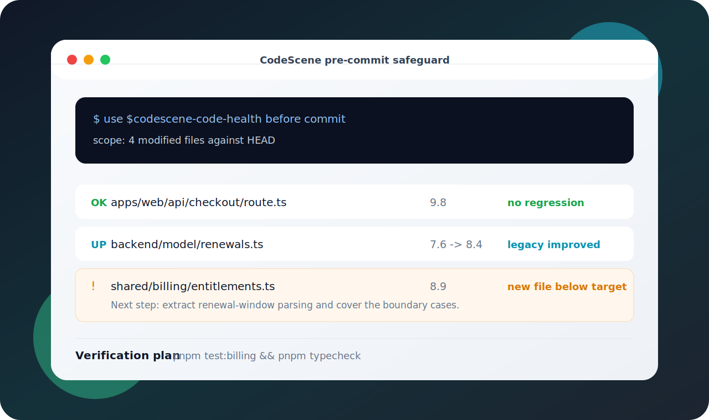
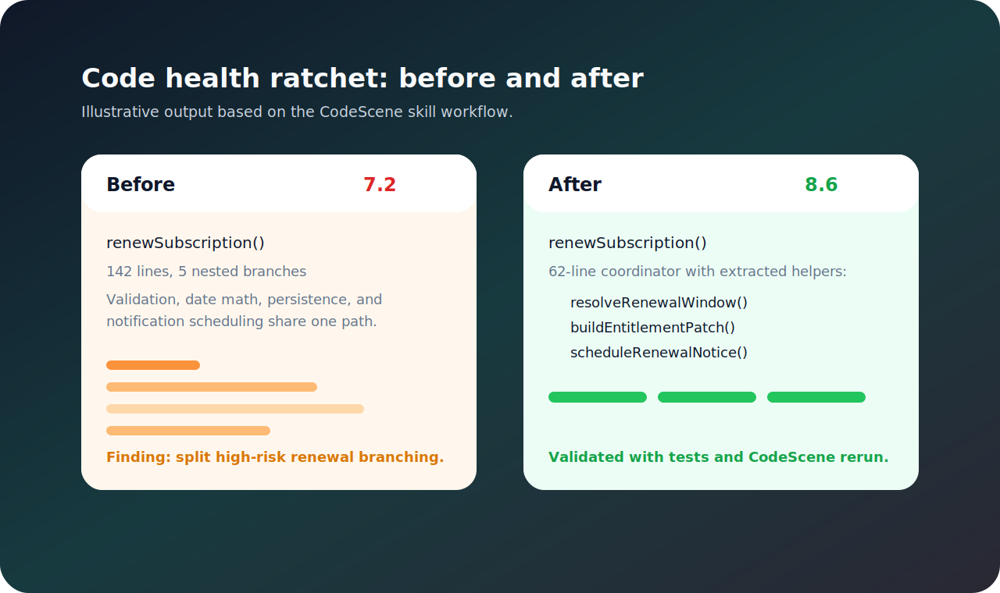
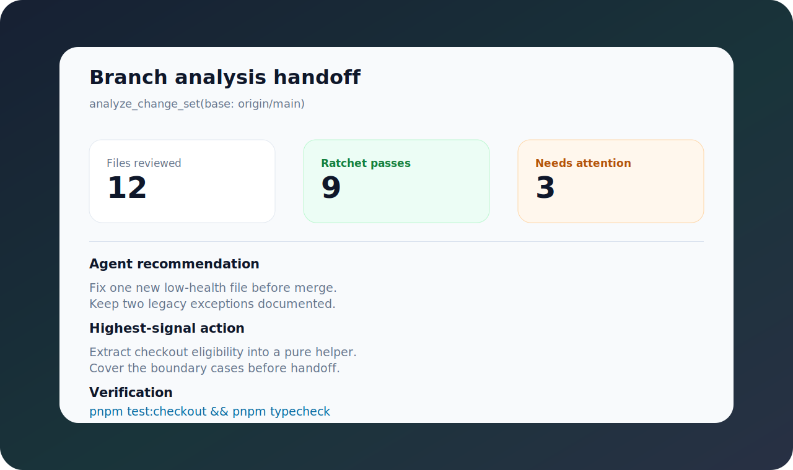

# CodeScene Skill

[](https://skills.sh/lucasheriques/codescene-skill)

Make Codex, Claude Code, and Cursor code-health aware with CodeScene's MCP server.

This skill helps agents review touched code, catch maintainability regressions before commit, and apply a simple quality ratchet: new code should be healthy, healthy code should not regress, and legacy code touched by the change should improve when practical.

Current release: `v0.1.4`.

## Why Add It

- Get CodeScene feedback inside your coding agent.
- Catch code-health issues before a PR review.
- Reuse one onboarding flow across projects.
- Keep CodeScene credentials out of git.

## Install

Install globally for every project:

```bash
npx skills add lucasheriques/codescene-skill \
  --skill codescene-code-health \
  --global \
  --agent codex \
  --agent claude-code \
  --agent cursor
```

Install into one project:

```bash
cd /path/to/project

npx skills add lucasheriques/codescene-skill \
  --skill codescene-code-health \
  --agent codex \
  --agent claude-code \
  --agent cursor
```

With GitHub CLI:

```bash
gh skill install lucasheriques/codescene-skill codescene-code-health --agent codex --scope user
gh skill install lucasheriques/codescene-skill codescene-code-health --agent claude-code --scope user
gh skill install lucasheriques/codescene-skill codescene-code-health --agent cursor --scope user
```

## Configure MCP

Get a token from [CodeScene CodeHealth MCP](https://codescene.com/product/code-health-mcp), then export it:

```bash
export CS_ACCESS_TOKEN="..."
```

Auto-add the CodeScene MCP server to Codex, Claude Code, and Cursor:

```bash
node ~/.agents/skills/codescene-code-health/scripts/install-mcp.mjs --scope user --apply
```

For a project-local setup:

```bash
node .agents/skills/codescene-code-health/scripts/install-mcp.mjs --scope project --apply
```

The helper writes agent config only. It does not write your token into git; agents read `CS_ACCESS_TOKEN` from the environment.

Restart your agent after MCP setup.

## Init A Project

Start in the repo and ask:

```text
Use $codescene-code-health to init CodeScene for this repo.
```

That is the portable version of the intended `$codescene init` flow. The agent should verify MCP setup, check the token, choose the right first CodeScene check, and tell you what to commit or keep local.

## Use

```text
Use $codescene-code-health to review my current changes before I commit.
```

```text
Run a CodeScene branch analysis against origin/main and help me fix the highest-signal findings.
```

```text
Score the files I touched and tell me whether the change respects our quality ratchet.
```

## What To Expect

The examples below are illustrative mockups, not output from a private repository.







## Develop

```bash
npm run validate
python3 ~/.codex/skills/.system/skill-creator/scripts/quick_validate.py skills/codescene-code-health
```

## License

MIT
